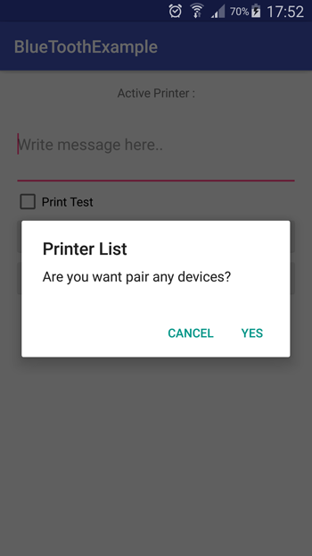
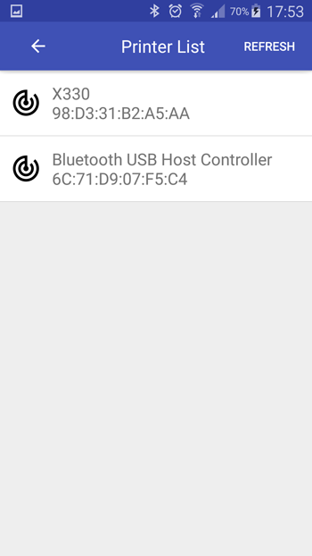
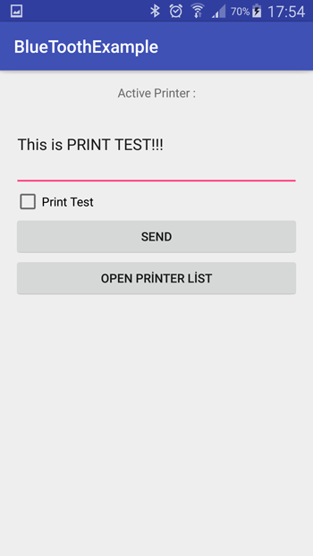
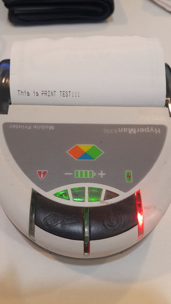
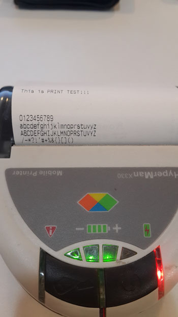

[](https://jitpack.io/#barisatalay/thermalprinterhelper)

# Thermal Printer Helper
My aim is to use the simplest way to print from a Bluetooth printer.

#Screen Shots

Works only on supported printers













## Usage

### Step 1
```groovy
allprojects {
		repositories {
			...
			maven { url 'https://jitpack.io' }
		}
	}
```

### Step 2

Add dependencies in build.gradle.
```groovy
    dependencies {
       compile 'com.github.barisatalay:thermalprinterhelper:v1.2.2'
    }
```

### Step 3 (Use of library)
Create BluetoothProvider;
```java
   //Parameter 1: Activity,
   //Paremeter 2: BluetoothCallback interface
   BluetoothProvider bluetoothProvider = new BluetoothProvider(this, this);
``` 

Code to connect to the terminal
```java
   //Control of required permissions.
   //Check terminal device pair / unpair control.
   //Connect to BluetoothSocket
   //If don't have any pair devices, if it have permission open devices activity 
   bluetoothProvider.connect()
```

If you want print test page
```java
   bluetoothProvider.printText(bluetoothProvider.prepareTestData())
```

Define the base64Image to print
```java
   //Works only on supported printers
   bluetoothProvider.printImageText("...")
```

Define the text to print
```java
   bluetoothProvider.printText("This is PRINT EXAMPLE!!!")
```

Define the byte array to print
```java
   //This value default false
   bluetoothProvider.printByteArray(PrinterCommands.FEED_LINE_2)
```

If you do not want to open the terminal device screen use this method
```java
   //This value default false
   bluetoothProvider.showPrinterListActivity(false);
   bluetoothProvider..setDeviceAddress("98:D3:31:B2:A5:AA");
```

!!IMPORTANT!! You are must be defined this codes

```xml
   <uses-permission android:name="android.permission.ACCESS_FINE_LOCATION" />
   <uses-permission android:name="android.permission.BLUETOOTH" />
   <uses-permission android:name="android.permission.BLUETOOTH_ADMIN" />
   
   
   <activity
            android:name="com.atalay.bluetoothhelper.View.PrinterList.PrinterListActivity"
            />
```


##Contact me

 If you have a better idea or way on this project, please let me know, thanks :)

[Email](mailto:b.atalay07@hotmail.com)

[My Blog](http://brsatalay.blogspot.com.tr)

[My Linkedin](http://linkedin.com/in/barisatalay07/)
